# مطالب مرتبط با سلامتی و بیو (گروه 17)

بازیابی اطلاعات - بهار 1400

اعضای گروه:

بهار اسدی

نگار نوبختی

ندا تقی‌زاده سراجه

## توضیحات کلاس‌ها و توابع

سرور پایتون پروژه متشکل از سه فایل است، server و ir_system و elastic_search. فایل سرور مسئول راه اندازی مدل‌های برنامه و gateway برای API برنامه است.

فایل ir_system حاوی کلاس‌هایی برای تمامی مدل‌های استفاده شده در برنامه است.

- BooleanRecommender: مدل بازیابی boolean
- TfIdfRecommender: مدل بازیابی Tf-Idf
- TransformerRecommender: بازیابی با استفاده از مدل‌های ترنسفورمر
- EmbedRecommender: بازیابی با استفاده از روش‌ بردار‌های تعبیه (FastText)
- classification: طبقه بندی
- clusterring: خوشه بندی
- TransformerVectorizer: تابع کمکی برای کلاس‌های طبقه بندی و خوشه بندی برای تبدیل داده‌ها به بردار

تمامی کلاس‌های بازیابی شامل سه تابع اصلی هستند. تابع run مدل اولیه را راه اندازی می‌کند. بردارها و داده‌های این مدل‌ها در فایل‌هایی ذخیره شده‌اند (تنها فایل‌هایی که حجم بالایی ندارند در گیت قرار گرفته‌اند) که در صورت وجود، تابع run تنها همان فایل‌ها را بارگذاری می‌کند. در غیر اینصورت مدل‌ها را می‌سازد و آنها را مجددا ذخیره می‌کند.

تابع recommend کوئری‌ای را به عنوان ورودی می‌گیرد و مستندات مشابه با آن را باز می‌گرداند. شیوه کار هر کدام از این مدل‌ها در طی تحویل تمرین‌ها شرح داده شده‌اند.

تابع expanded_recommend نیز برای بازیابی مستندات استفاده می‌شود، با این تفاوت که در آن از الگوریتم Rocchio برای گسترش کوئری استفاده می‌شود. در بخش‌های بعدی توضیحات بیشتری در این باره داده شده است.

فایل elastic_search که شامل کلاس ElasticsearchResult است، مسئول برقراری ارتباط با elasticsearch است. برای ایندکس کردن داده‌ها و بازیابی آنها، یک deploy در elastic cloud ایجاد شده که از رمز و آی دی کاربری آن برای اتصال به آن استفاده می‌شود. در هر بار اجرا، داده‌ها در این مرورگر ایندکس می‌شوند و در صورت انتخاب گزینه جست‌وجوی گسترش یافته، درخواست جست و جو به آن ارسال می‌شود.

**پس از بررسی نتایج خروجی elasticsearch مشاهده شد که این مرورگر نسبت به تمامی مدل‌های پیاده‌سازی شده برنامه نتیجه بهتری را ارائه می‌دهد.**

نمونه‌ای از خروجی هر کدام از این مدل‌ها در گزارش قرار داده شده‌اند.

- بازیابی boolean (با و بدون گسترش کوئری)

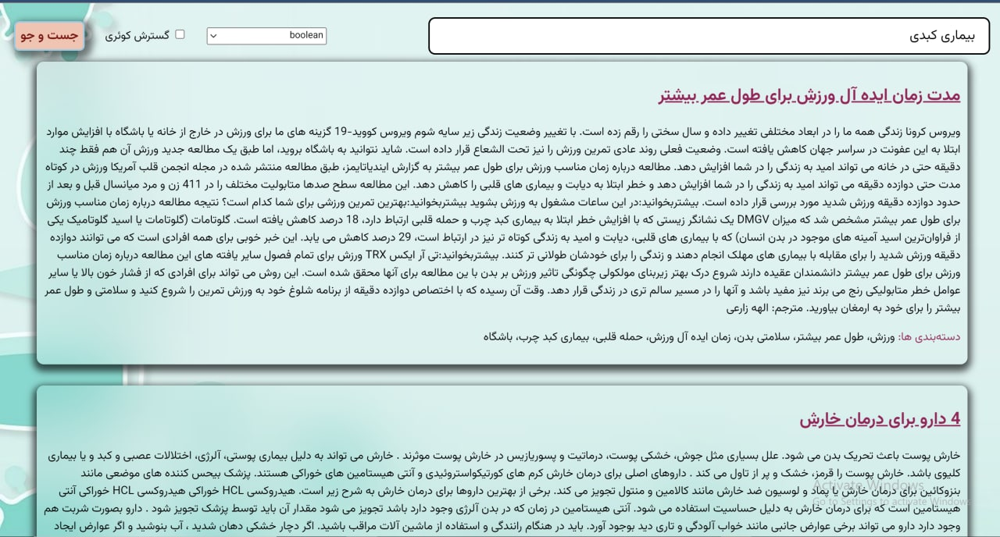

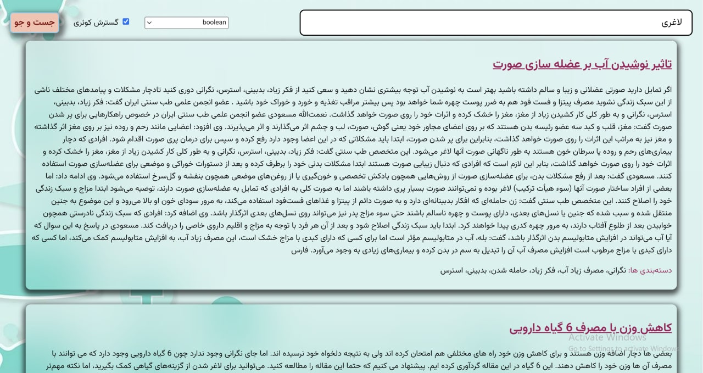

- بازیابی TfIdf (با و بدون گسترش کوئری)

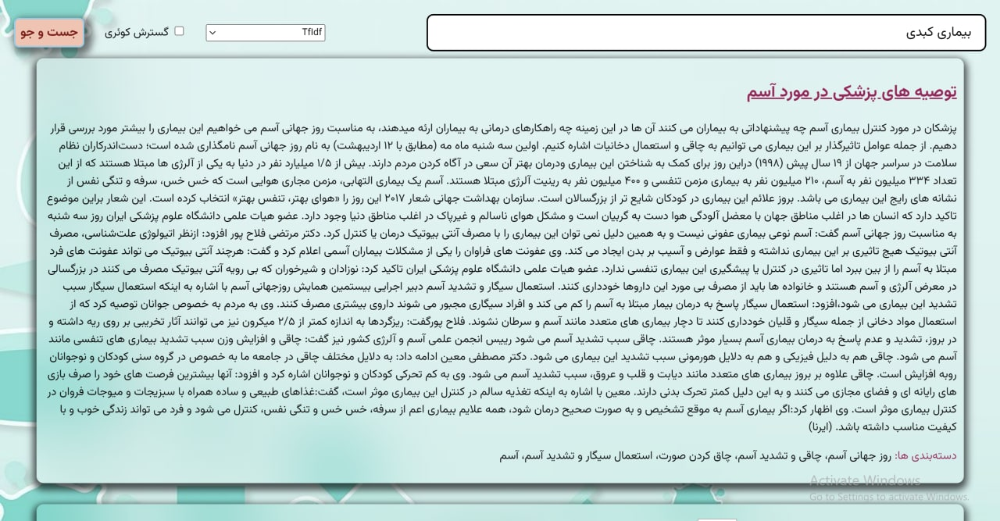

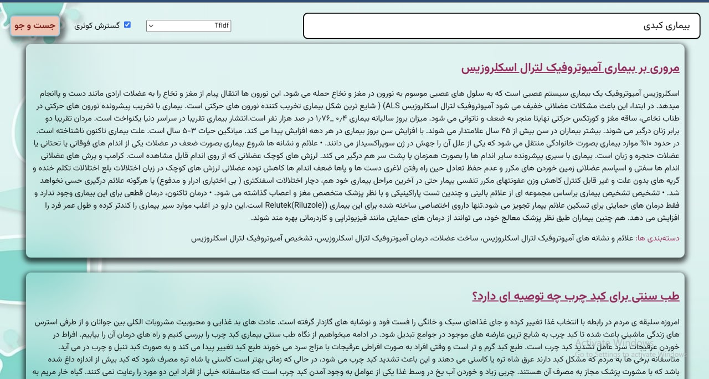

- بازیابی Transformer (با و بدون گسترش کوئری)

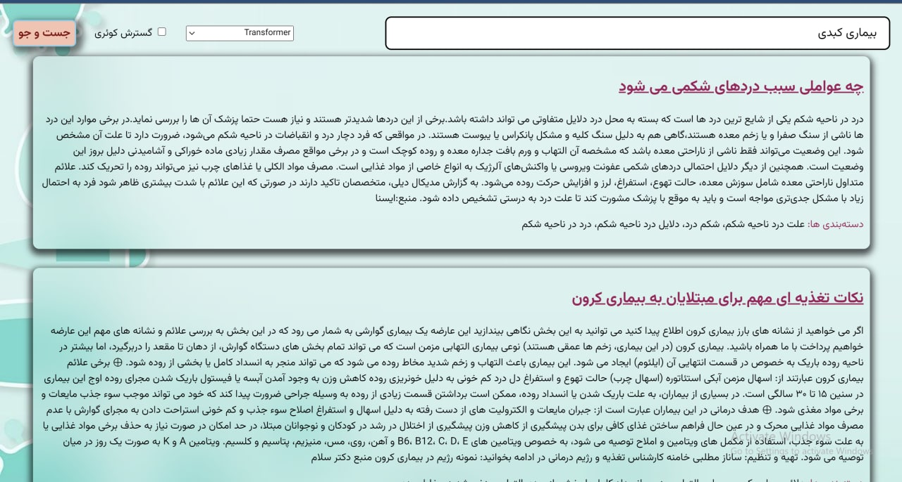

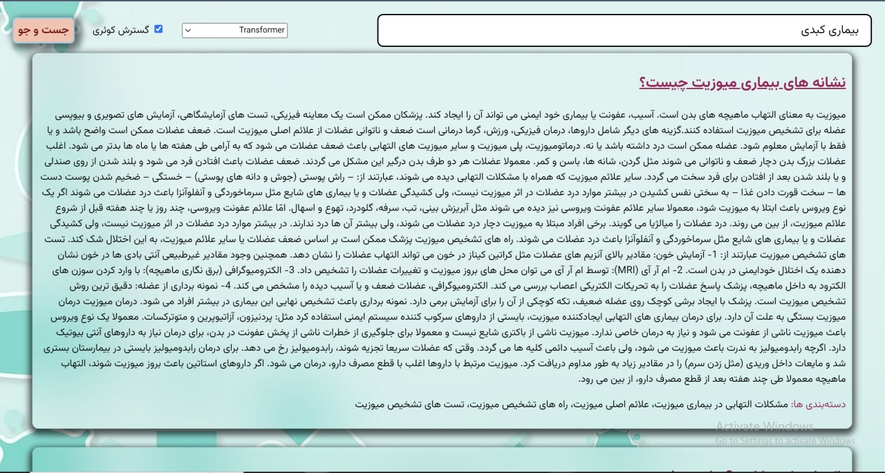

- بازیابی با FastText (با و بدون گسترش کوئری)

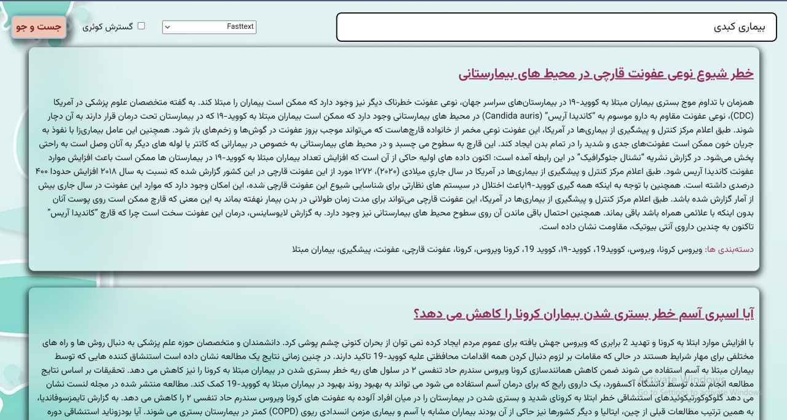

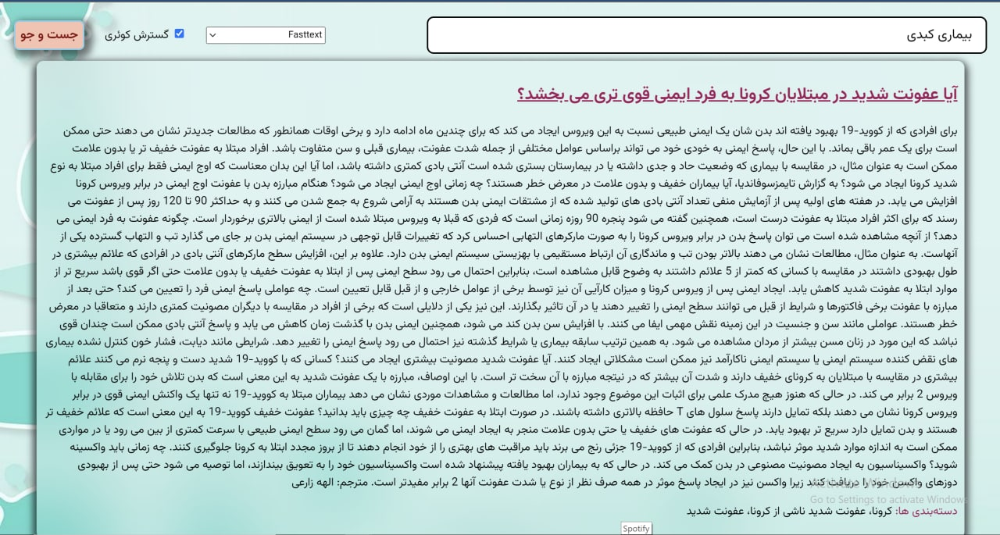

- بازیابی با استفاده از elasticsearch

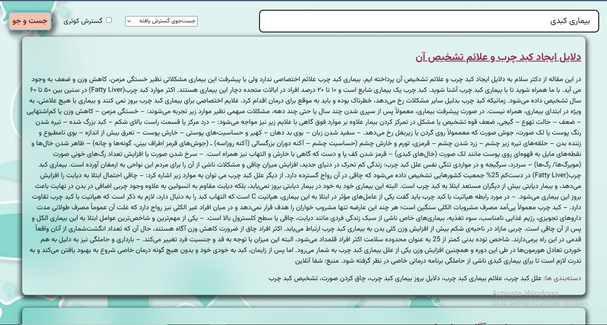

- طبقه‌بندی

- خوشه بندی

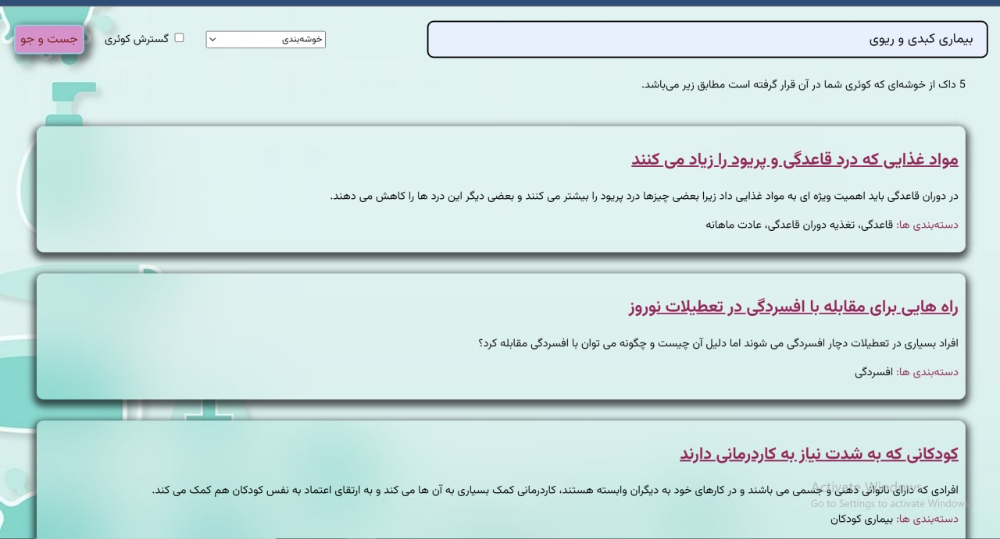

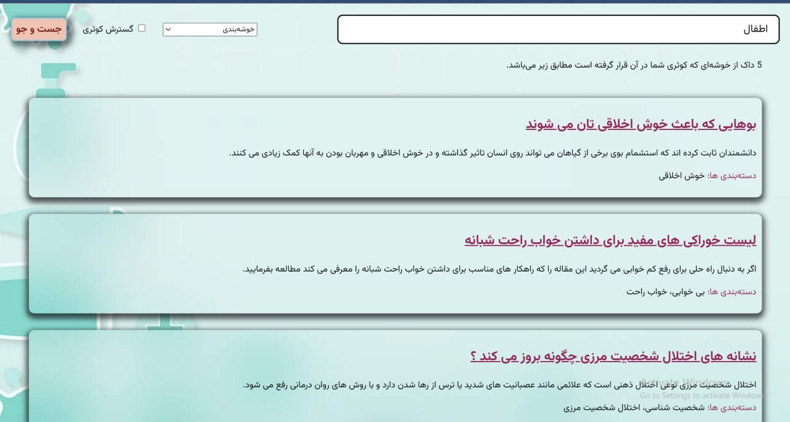

## گسترش کوئری

برای گسترش کوئری به منظور بهتر کردن نتایج از الگوریتم Rocchio استفاده کردیم. براساس فرمول ارائه شده در این الگوریتم، که در ادامه آورده شده است، داکیومنتهای مربوط و نامربوط را از میان همه داکیومنتها براساس فاصله کسینوسی گرفته و بردار جدید مربوط به کوئری را محاسبه میکنیم و مجددا با استفاده از آن 10 داکیومنتی که بیشتر مرتبط هستند را به عنوان خروجی به کاربر ارائه میدهیم. مقدار ضرایب آلفا، بتا و گاما به صورت تجربی به دست می آید و در تحقیقات مختلف بیان شده است که نتیجه منطقی زمانی است که مقدار آلفا برابر 1 و مقدار بتا برابر 0.75 و مقدار گاما برابر 0.25 باشد البته برخی از سیستمها تنها با استفاده از فیدبک مثبت کوئری را گسترش میدهند که یعنی در این سیستمها مقدار گاما برابر 0 است اما ما در سیستم خود با همان مقدار دهی که منطقی ترین نتیجه را میدهد خروجی را تولید کردیم.

### MRR

پس از پیاده سازی گسترش کوئری، کوئری‌های مشابه با تمرین سوم را به برنامه دادیم و بر اساس اولین کوئری مرتبط، MRR را برای چهار مدل مجددا محاسبه کردیم. نتیجه محاسبات به شرح زیر است:

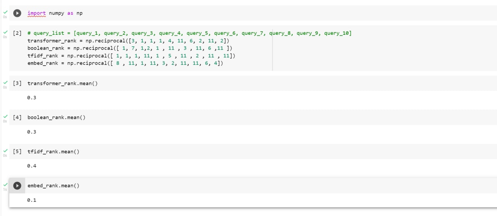

## ارتقا طبقه‌بندی و خوشه‌بندی

برای ارتقا کیفیت مدل‌های طبقه‌بندی و خوشه‌بندی دو کار انجام شد:

1- مدل ترنسفورمر از distiluse-base-multilingual-cased-v2 به paraphrase-multilingual-mpnet-base-v2

2- تغییر نسبت داده تست به کل داده‌ها از 0.25 به 0.35

با اعمال این دو تغییر امتیاز f1 مدل طبقه‌بندی زا 65% به 77% و امتیاز purity مدل خوشه‌بندی از 65% به 66% افزایش یافت.

## راه اندازی پروژه

پس از نصب نیازمندی‌های بیان شده در فایل requirements.txt ترمینال را در مسیر فایل‌های پروژه باز کنید و دستور زیر را در آن وارد کنید:

    uvicorn server:app --reload 8000

بار اول به دلیل نبودن برخی مدل‌ها بالا آمدن سرور ممکن است طول بکشد، اما در دفعات بعد این زمان حدود 5 دقیقه خواهد بود.

پس از بالا آمدن سرور، فایل index.html را در مرورگر خود باز کنید. پس از نوشتن کوئری و انتخاب تنظیمات مورد نظر، دکمه جست و جو را بزنید تا درخواست به سرور ارسال شده و پاسخ آن در صفحه مشاهده شود. (از روشن بودن اکستنشن Moesif اطمینان حاصل کنید).
